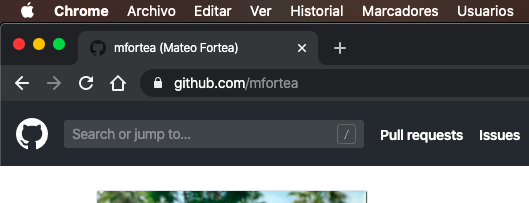

# **UNIDAD 6:** DOCUMENTACIÓN Y CONTROL DE VERSIONES

### Links externos de esta unidad:

- 📊 [Diapositivas de la Unidad 6](http://jamj2000.github.io/despliegueaplicacionesweb/6/diapositivas)
- 📚 [Actividades de la Unidad 6](http://jamj2000.github.io/despliegueaplicacionesweb/6/actividades)
- 🔙 [Volver a README](README)

---

## Índice

- 1- Introducción
  - 1.1 - En esta Unidad aprenderemos
- 2 - Documentación con Markdown
  - 2.1 - Cabeceras
  - 2.2 - Listas sin orden
  - 2.3 - Lista con orden
  - 2.4 - Formato
  - 2.5 - Enlaces
  - 2.6 - Imágenes
  - 2.7 - Citaciones
  - 2.8 - Tablas
  - 2.9 - Menciones de Github
  - 2.10 - Combinación con código HTML
- 3 - Control de versiones con git
  - 3.1 - Instalación de git
  - 3.2 - Configuración de git
  - 3.3 - Iniciar repositorio local
  - 3.4 - Comandos básicos
  - 3.5 - Clonar repositorio remoto
  - 3.6 - Vincular y desvincular repositorio remoto
  - 3.7 - Bajar y subir contenido a repositorio remoto
  - 3.8 - Trabajo con ramas
  - 3.9 - Checkout
  - 3.10 - Etiquetas de anotación

---

## 1️⃣ - Introducción

### 1.1 - En esta Unidad aprenderemos a

- Identificar diferentes herramientas de generación de documentación.
- Utilizar diferentes formatos para la documentación.
- Utilizar herramientas colaborativas para la elaboración y mantenimiento de la documentación.
- Instalar, configurar y utilizar un sistema de control de versiones.

---

## 2️⃣ - Documentación con Markdown

### 2.1 - Cabeceras

```markdown
# Cabecera de nivel 1

## Cabecera de nivel 2

### Cabecera de nivel 3

#### Cabecera de nivel 4

##### Cabecera de nivel 5

###### Cabecera de nivel 6
```

---

### 2.2 - Listas sin orden

Para mostrar listas desordenadas. ***La indentación es importante.***

```markdown
- Item 1
- Item 2
  - Item 2a
  - Item 2b
```

La vista previa del código anterior sería:

- Item 1
- Item 2
  - Item 2a
  - Item 2b

---

### 2.3 - Lista con orden

Para mostrar listas ordenadas.

```markdown
1. Item 1
2. Item 2
3. Item 3
   - Item 3a
   - Item 3b
```

La vista previa del código anterior sería:

1. Item 1
2. Item 2
3. Item 3
   - Item 3a
   - Item 3b

---

### 2.4 - Formato

Para mostrar el texto en cursiva

```markdown
*Este texto se muestra en cursiva*
_Este también se mostrará en cursiva_
```

Para mostrar el texto en negrita

```markdown
**Este texto se muestra en negrita**
__Este también se mostrará en negrita__
```

Combinación de ambos formatos

```markdown
_Puedes **combinar** ambos formatos_
```

---

### 2.5 - Enlaces

**Enlaces automáticos ->** Markdown detecta que es un enlace y lo crea automáticamente a la misma dirección a la que se refiere.

```markdown
ENLACE AUTOMÁTICO -> http://github.com
```

**Enlace manual ->** Se indica el texto que se quiere mostrar para acceder a un enlace.

```markdown
ENLACE MANUAL -> [GitHub](http://github.com)
```

**Vista previa**  
ENLACE AUTOMÁTICO -> http://github.com  
ENLACE MANUAL -> [GitHub](http://github.com)

---

### 2.6 - Imágenes

```markdown
Su formato es: 
Por ejemplo: 
```

**Vista previa**  
Por ejemplo:  


---

### 2.7 - Citaciones

Para representar citas, usamos el formato siguiente:

```markdown
Como dijo Charles Chaplin:

> Nunca te olvides de sonreír, porque el día
> que no sonrías, será un día perdido
```

**Vista previa**  
Como dijo Charles Chaplin:

> Nunca te olvides de sonreír, porque el día
> que no sonrías, será un día perdido

---

### 2.8 - Tablas

Para crear tablas con Markdown, seguimos la siguiente sintaxis:

```markdown
| Nombre  | Apellidos  | Usuario de Github |
| ------- | ---------- | ----------------- |
| Nombre1 | Apellidos1 | @usuario1         |
| Nombre2 | Apellidos2 | @usuario2         |
| Nombre3 | Apellidos3 | @usuario3         |
| Nombre4 | Apellidos4 | @usuario4         |
| Nombre5 | Apellidos5 | @usuario5         |
| ...     | ...        | ...               |
```

Que mostraría lo siguiente:

| Nombre  | Apellidos  | Usuario de Github |
| ------- | ---------- | ----------------- |
| Nombre1 | Apellidos1 | @usuario1         |
| Nombre2 | Apellidos2 | @usuario2         |
| Nombre3 | Apellidos3 | @usuario3         |
| Nombre4 | Apellidos4 | @usuario4         |
| Nombre5 | Apellidos5 | @usuario5         |
| ...     | ...        | ...               |

---

### 2.9 - Menciones de Github

Podemos realizar meciones a usuarios con el formato siguiente:

```markdown
** @usuario **
```

O también podemos realizar una mención a una "issue" o a un "pull request" por su número identificativo:

```markdown
** #numero **
```

---

### 2.10 - Combinación con código HTML

Markdown soporta la inclusión de código HTML para dar aún más posibilidades a su formato.

Por ejemplo, para añadir la imagen anterior, y poder redimensionarla a nuestro gusto, podemos añadir código HTML e indicarle las dimensiones, y Markdown lo reconocerá sin problemas.

```markdown

```

**Vista previa**  


Incluso podemos realizar combinaciones de etiquetas, como las etiquetas imágenes dentro de un enlace. Por ejemplo, al hacer clic sobre la captura, en este caso se dirige a la ruta de mi perfil:

```markdown
<a href="http://github.com/mfortea"></a>
```

**Vista previa**  
<a href="http://github.com/mfortea"></a>

---

## 3️⃣ - Control de versiones con git

### 3.1 - Instalación de git

Para instalar "git" en una máquina Linux, usamos:

```bash
sudo  apt  install  git
```

### 3.2 - Configuración de git

Para configurar nuestro usuario y email que vamos a utilizar con git:

```bash
git  config  --global  user.name   "Nombre y Apellidos"
git  config  --global  user.email  "nombre@mail.com"
```

### 3.3 - Iniciar repositorio local

Para iniciar un directorio como repositorio local:

```bash
git  init
```

_Se recomienda crear un archivo `.gitignore` con listado de carpetas y archivos a los que no se realizará seguimiento._

### 3.4 - Comandos básicos

Para mostrar el estado del repositorio en el que nos encontramos:

```bash
git  status
```

Para realizar un seguimiento a los ficheros y directorios que se indiquen. _El punto (.) indica todos los ficheros del directorio actual._

```bash
git  add .
```

Se guarda un commit de los cambios hechos hasta ese momento. _Con -m indicamos un mensaje._

```bash
git  commit -m  "Mensaje"
```

### 3.5 - Clonar repositorio remoto

Para descargar un repositorio remoto:

```bash
git  clone   https://github.com/usuario/repositorio.git // Usando HTTPS
git  clone   git@github.com:usuario/repositorio.git // Usando SSH
```

### 3.6 - Vincular y desvincular repositorio remoto

```bash
git  remote  -v
git  remote  add  origin  https://github.com/usuario/repositorio.git
git  remote  rm   origin
```

### 3.7 - Bajar y subir contenido a repositorio remoto

```bash
git  pull  origin  master  // Baja los commits realizados en el repositorio remoto
git  push  origin  master  // Sube los commits en el repositorio remoto
```

### 3.8 - Trabajo con ramas

```bash
git  branch    -va        // Realiza un listado verbose, all (local y remoto)

git  branch    nuevo      // Crea una rama
git  checkout  nuevo      // Se cambia a una rama concreta

git  checkout  -b nuevo   // Crea una nueva rama, y se cambia a ella
```

### 3.9 - Checkout

El comando **`checkout`** de `git` sirve para **cambiar de rama**.

```bash
git  checkout  rama
```

También sirve para **cambiar de commit dentro de una rama** si se indican los primeros dígitos identificativos del commit.

```bash
git  checkout  0f82
```

### 3.10 - Etiquetas de anotación

```bash
git tag -l                          // Lista las etiquetas
git tag -a v1.0 -m "Version 1.0"    // Añade una nueva etiqueta
git tag -d v1.0                     // Elimina una etiqueta
```

Las etiquetas deben enviarse explícitamente al repositorio remoto:

```bash
git  push  --tags // Sube los cambios realizados en las etiquetas
```
